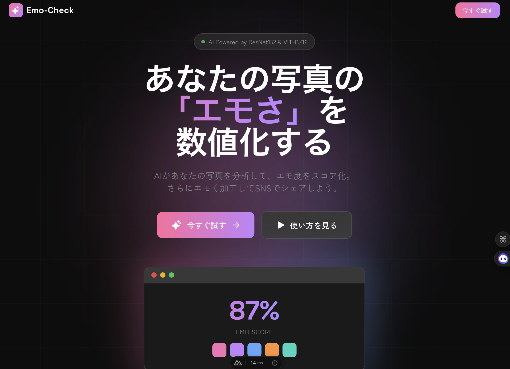

# Emo-Check

**「その写真、エモい？」AIが判定 & 加工してSNSでシェア**

写真の「エモさ」をディープラーニング（ResNet152 / ViT-B/16）で数値化。さらに「ピクセルアート」や「Y2Kフィルム風」に加工してエモ度をブーストできるWebアプリです。



---

## 機能

### エモ度判定（AI Scoring）
- **ResNet152**：画像の細部（色・質感）を重視して判定
- **ViT-B/16**：写真全体の構図や雰囲気を重視して判定
- 2つのモデルを切り替えて、CNNとTransformerの違いを体感できます

### カラーパレット分析
- 画像から主要な5色を抽出
- 写真の「ムード」を可視化

### エモ成分分析
- ノスタルジー、儚さ、青春、メランコリーなど
- 写真の「エモさ」の内訳を表示
- AIによるコメント付き

### Emo-Booster（画像加工）
- **Pixel Art Mode**：ドット絵化 + 減色処理
- **Y2K Film Mode**：フィルムノイズ + 日付焼き込み + 色調補正
- **Before/After スライダー**：加工前後を直感的に比較

### シェアカード生成
- 結果をカード画像として生成
- SNSでそのままシェア可能

---

## 技術スタック

### フロントエンド
| 技術 | 用途 |
|------|------|
| Nuxt 3 | フレームワーク |
| TypeScript | 型安全な開発 |
| Tailwind CSS | スタイリング |
| Phosphor Icons | アイコン |
| html2canvas | シェアカード生成 |

### バックエンド
| 技術 | 用途 |
|------|------|
| FastAPI | APIサーバー |
| PyTorch | 機械学習モデル |
| OpenCV | 画像処理 |
| Pillow | 画像読み込み（HEIC対応） |
| scikit-learn | K-meansクラスタリング |

### モデル
| モデル | 特徴 |
|--------|------|
| ResNet152 | CNNベース、局所的な特徴を抽出 |
| ViT-B/16 | Transformerベース、全体の文脈を理解 |

---

## プロジェクト構成

```
Emo-Check/
├── backend/                 # FastAPI サーバー
│   ├── app.py               # APIエントリーポイント
│   ├── image_processing.py  # 画像処理ロジック
│   └── models/              # 学習済みモデル（.pth）
│
├── frontend/                # Nuxt 3 クライアント
│   ├── components/          # UIコンポーネント
│   ├── composables/         # 共通ロジック
│   ├── pages/               # ページ（index, app）
│   └── public/              # 静的ファイル
│
└── training/                # モデル学習
    ├── dataset/             # 学習用画像
    ├── train_resnet.ipynb   # ResNet152学習ノートブック
    └── train_vit.ipynb      # ViT-B/16学習ノートブック
```

---

## セットアップ

### 必要環境
- Python 3.9+
- Node.js 18+

### 1. バックエンド
```bash
# 仮想環境を作成
python -m venv .venv
source .venv/bin/activate

# 依存関係をインストール
pip install torch torchvision fastapi uvicorn pillow opencv-python scikit-learn pillow-heif

# サーバー起動
cd backend
uvicorn app:app --host 0.0.0.0 --port 8000 --reload
```

### 2. フロントエンド
```bash
cd frontend
npm install
npm run dev
```

### 3. アクセス
- フロントエンド: http://localhost:3000
- API: http://localhost:8000/docs

---

## モデルの学習

```bash
# 学習用画像を配置
training/dataset/
├── emo/      # エモい画像
└── not_emo/  # エモくない画像
```

Jupyterノートブックを実行後、`backend/models/`にモデルファイルをコピー。

---

## 対応フォーマット

JPEG / PNG / WebP / HEIC

---

## ライセンス

MIT License
